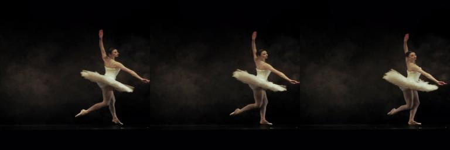

# video_to_concatenated_image_sequence_tool

a video to image tool to generate concatenated image sequence dataset

requirements: python 2.7

packages: imageio, scikit-image

## usage
python convertor.py convertor.py \<video filename\> \<concat_axis\> \<concat_size\> \<frame range\> \<frame clip\> \<resize\>

ex.

python convertor.py "Ballet Dancer On Stage.mp4" 1 3 "62,82" "0,360,720,920" "256,256"

it converts the video "Ballet Dancer On Stage.mp4" to the horizontally concatenated image sequence from the frame 62 to 82.

Each frame is cropped by (360,920) to (0,720) and then resize to 256 * 256

the example result:

the example video is downloaded from the free video site "pexels videos".

### \<video filename\>
video filename (string)

ex. "video.mp4"

### \<concat_axis\>
Image concatenate axis. 

0: vertically concatenate

1: horizontally concatenate

### \<concat_size\>
Image concatenate window size. 

ex. 3

###  \<frame range\>
starting and ending frame number 

ex. "100,120"

### \<frame crop\> 
crop each frame by describing y1,x1,y2,x2

ex. "0,320,720,960"

### \<resize\>
resize the frame which run after th clip process and before the concatenation

ex. "640,640"

